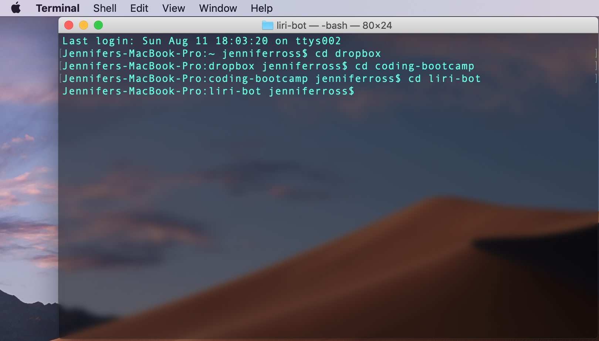
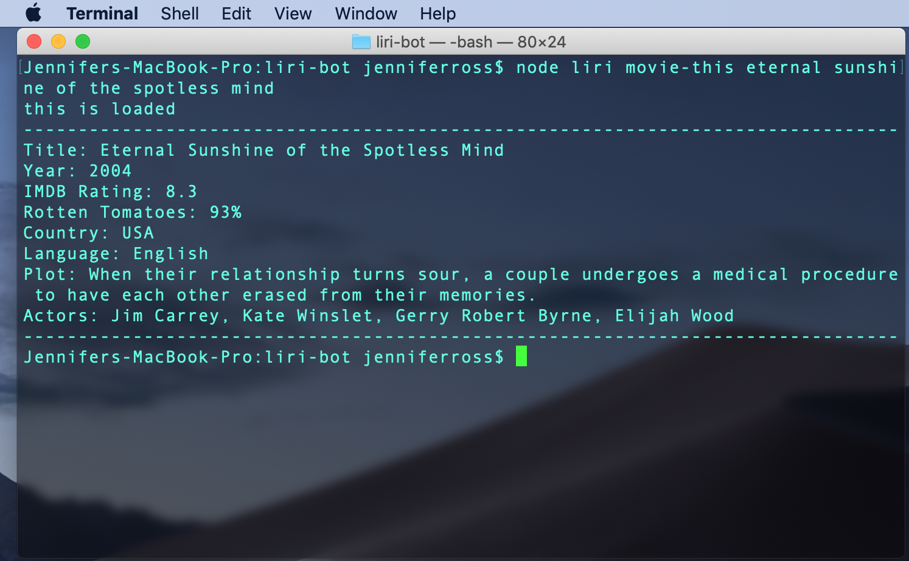
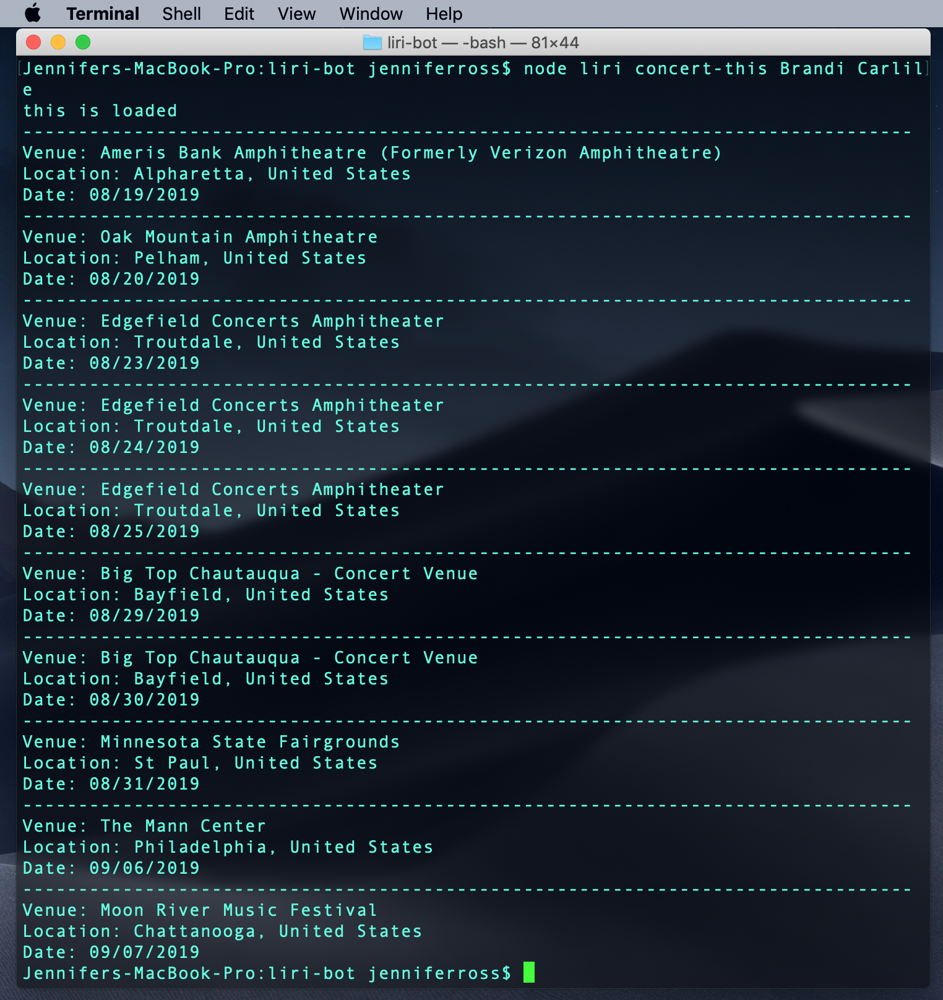
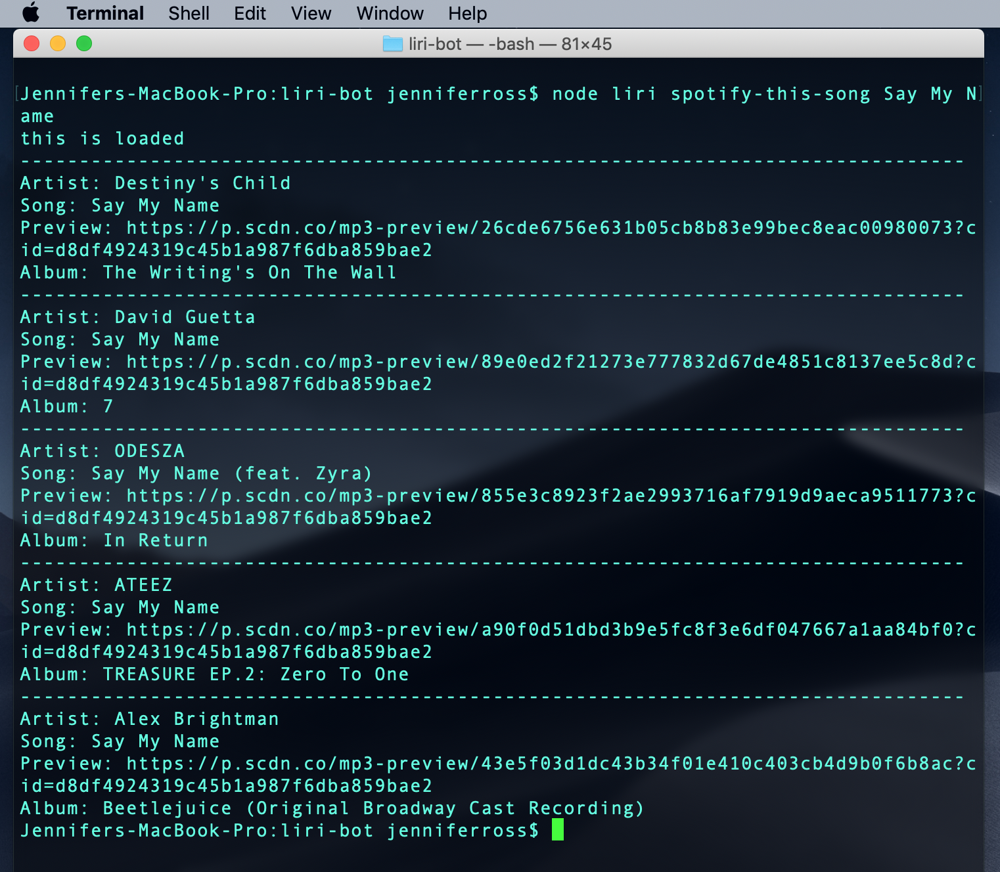
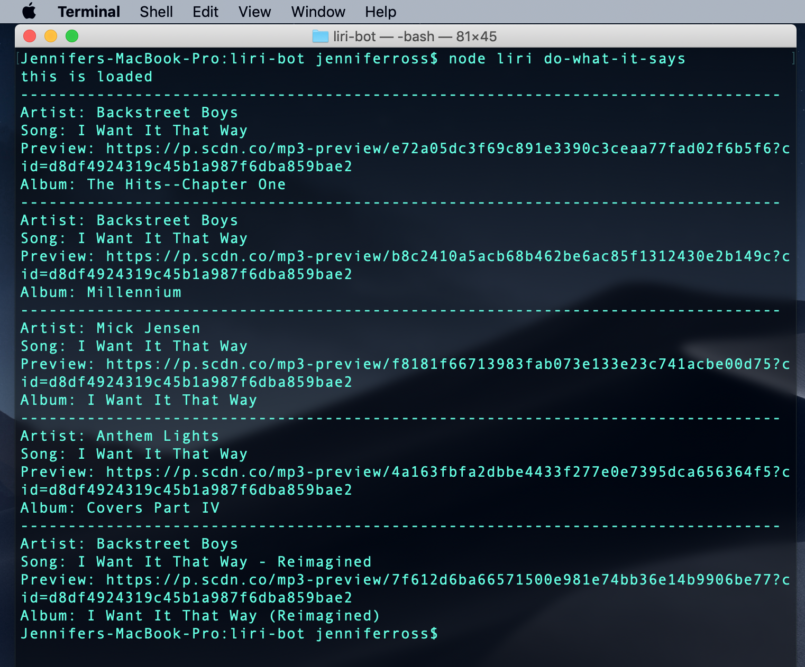

# Liri

## About 

Liri is a command-line application that provides information about songs, concerts, and movies based on specific commands and user search input. 

## Technologies Used 

* JavaScript
* Node.js
* JSON
* APIs: 
    * Spotify
    * Bands in Town
    * OMDB

## How to Use It

1. Open up your terminal/bash window and navigate to the folder/directory for "liri-bot" where the file "liri.js" is stored. 

2. Type "node liri movie-this 'name of movie'" to see information pulled from the OMDB API about that movie. For example: 

3. Type "node liri concert-this 'name of artist'" to see the top 10 upcoming concert locations and dates. For example: 

4. Type "node liri spotify-this-song 'name of song'" to see the top 5 songs on Spotify associated with your search. For example: 

5. Type "node liri do-what-it-says" and the program will read the "random.txt" file and run the command and search it specifies. For example: 

